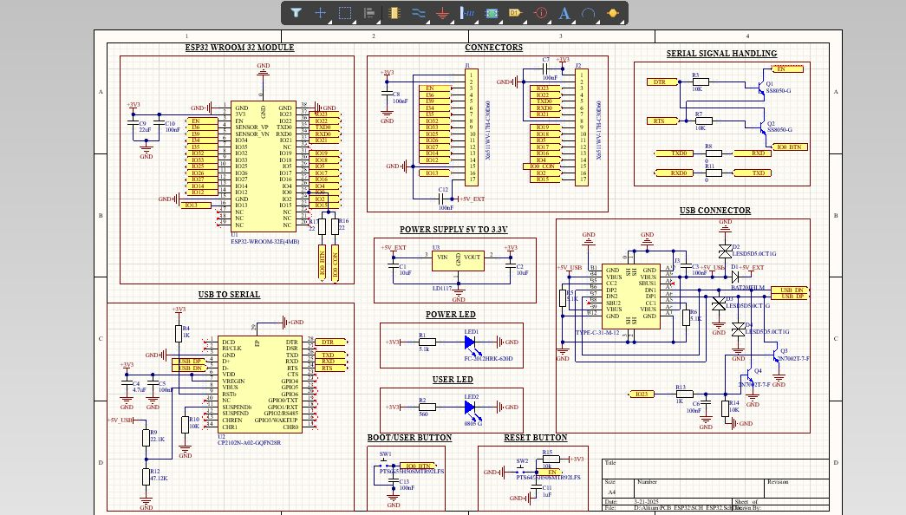
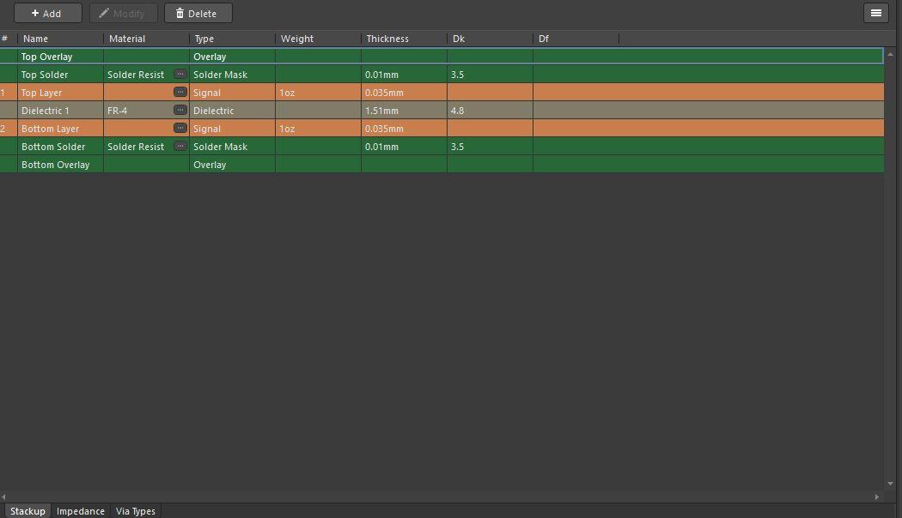
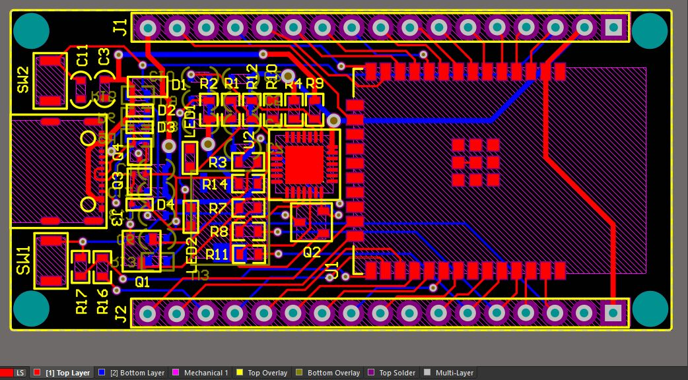
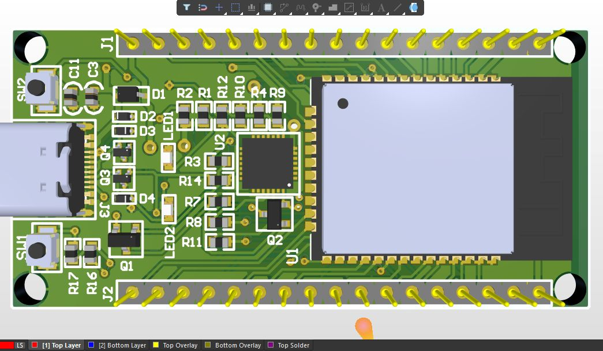
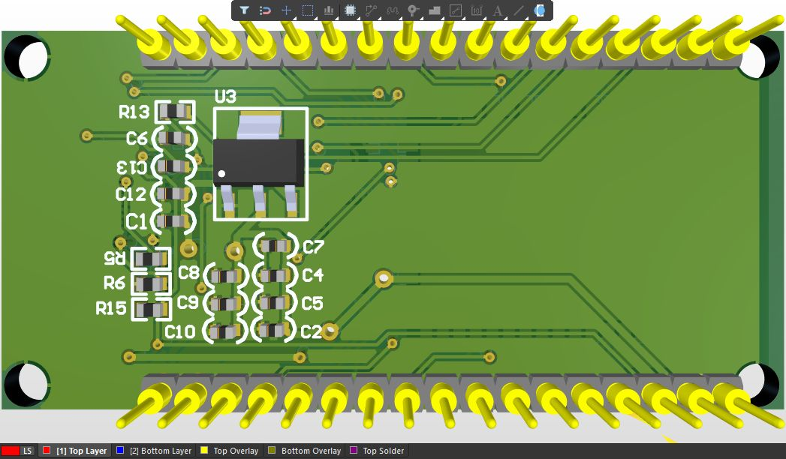

# ESP32-PCB-Design
PCB design project demonstrating schematic capture, 2-layer PCB layout, and design rule validation using Altium.

## 📌 Project Overview
This repository contains the design files and documentation for a **PCB design project**. The project focuses on applying **core PCB design principles**, including schematic capture, component placement, routing, and design rule checks for a functional electronic circuit. The objective of this project was to gain hands-on experience in **professional PCB design workflows** used in hardware and embedded systems development.

## 🎯 Objectives
- Understand schematic design and netlist creation  
- Perform component placement and signal routing on a 2-layer PCB  
- Apply PCB design rules for manufacturability  
- Gain practical exposure to PCB design tools and workflows  

## 🛠️ Design Tools Used
- KiCad / Altium Designer  
- Design Rule Check (DRC) tools  
- ERC (Electrical Rule Check)  

## ⚙️ PCB Design Details
- Board Type: 2-layer PCB  
- Schematic capture with proper power and signal labeling  
- Optimized component placement for routing efficiency  
- Manual routing with focus on signal integrity and clean layout  
- Ground plane implementation and basic power routing

## ✅ Key Learnings
- Schematic-to-PCB workflow  
- Component footprint selection  
- Routing strategies for 2-layer PCBs  
- Design rule checking and error resolution  
- Understanding real-world PCB design constraints  

## 🚀 Future Improvements
- Convert the design into a fully fabricated PCB  
- Improve layout optimization and footprint compactness  
- Add silkscreen annotations and test points  
- Extend the design with additional peripherals

## 📷 Project Preview

### Schematic

### Layer Stackup

### 2D PCB Layout

### 3D PCB Layout

## 📄 License
This project is intended for **learning and educational purposes**.

